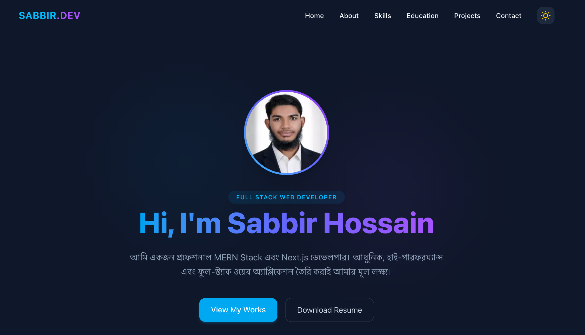

# MERN Stack Developer Portfolio 🚀

স্বাগতম! এটি আমার ব্যক্তিগত পোর্ফোলিও ওয়েবসাইট, যা Next.js ১৫, React এবং Tailwind CSS ব্যবহার করে তৈরি করা হয়েছে। এই প্ল্যাটফর্মটিতে আমার তৈরি করা সেরা প্রজেক্টস, স্কিলস এবং আমার ব্যাকএন্ড ও ফ্রন্টএন্ড দক্ষতার একটি বাস্তব প্রতিফলন রয়েছে।

## 📸 Preview


---

## ✨ Features

- **Modern & Clean UI:** Tailwind CSS, DaisyUI এবং HeroUI দিয়ে তৈরি চমৎকার রেসপন্সিভ ইন্টারফেস।
- **Dynamic Project Showcases:** প্রজেক্টের বিস্তারিত তথ্য, চ্যালেঞ্জ এবং ফিউচার প্ল্যানসহ ইন্টারেক্টিভ মডাল পপআপ সিস্টেম।
- **Seamless Dark/Light Mode:** ইউজার এক্সপেরিয়েন্স উন্নত করতে স্মুথ থিম টগলিং ব্যবস্থা।
- **Fully Responsive:** মোবাইল, ট্যাবলেট এবং ডেস্কটপসহ যেকোনো স্ক্রিন সাইজের জন্য পারফেক্টলি অপ্টিমাইজড।
- **Clean Structure:** Next.js-এর আধুনিক অ্যাপ রাউটার (App Router) এবং কম্পোনেন্ট-বেসড আর্কিটেকচার।

---

## 🛠️ Tech Stack

**Frontend:**
- Next.js 15 (App Router)
- React.js
- Tailwind CSS (DaisyUI / HeroUI)
- React Icons

**Backend & Database:**
- Node.js & Express.js (For full-stack integration)
- MongoDB Atlas & Mongoose
- Better-Auth (Secure Authentication System)

---

## 🚀 Getting Started

প্রজেক্টটি লোকালি রান করতে চাইলে নিচের স্টেপগুলো ফলো করো:

১. **ক্লোন করো রিপোজিটরি:**
   ```bash
   git clone [https://github.com/sabbirhossain778/A5-Portfolio.git](https://github.com/sabbirhossain778/A5-Portfolio.git)
   cd A5-Portfolio
